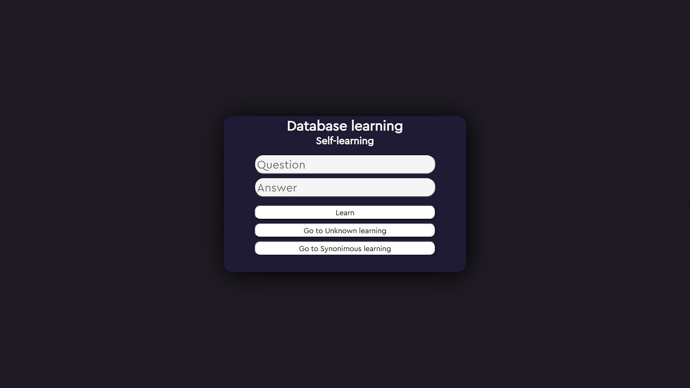

# iha-answerer.js
Болталка, вырезанная из приложения `FP iHA bot`. С панелькой обучения базы!

## Пример
```js
const AnswerDatabase = require("./index")

const AnswerDB = new AnswerDatabase("./databases/answer_databse.bin")

const question = "Привет!"

AnswerDB.getMaxValidAnswer(question) // ку-ку, епта
```

## Установка
1. Скачайте/клонируйте репозиторий.
2. `node test.js`

## Настройка панельки обучения базы
1. Перейдите в папку `learning_server`
2. Пропишите `npm install`
3. Пропишите `npm start`
4. Перейдите на [http://127.0.0.1:1666/](http://127.0.0.1:1666/)



## Полезная информация
* Здесь уже предоставлена базовая база ответов, идущая в приложении `FP iHA bot`. Файл: `./databases/answer_databse.bin`
* Базу можно обучать в панельке. Гайд по настройке выше.
* В случае, если база не сможет обнаружить подходящий ответ, она отправит запрос в файл `unknown.json`

## Связь с автором
Telegram: [t.me/tailsjs](https://t.me/tailsjs)<br>
TailiumBox (Telegram): [t.me/tailiumbox_bot](https://t.me/tailiumbox_bot)